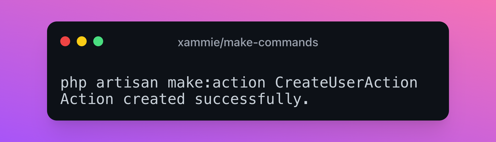

I have created a [Laravel package](https://github.com/Xammie/make-commands) that adds new make commands to your app.

You can install the package via composer

```bash
composer require --dev xammie/make-commands
```

## Usage

After you have installed it the following commands will be available.

Create a action class in `app/Actions`

```bash
php artisan make:action CreateUserAction
```

Create an enum in `app/Enums`

```bash
php artisan make:enum OrderStatusEnum
```

Create a service class in `app/Services`

```bash
php artisan make:service PaymentService
```

Create a contract interface in `app/Contracts`

```bash
php artisan make:contract CreatesUserContract
```

Create a dto class in `app/Dtos`
```bash
php artisan make:dto RestRequestObject
```

These commands can be useful if you use these kinds of classes in your Laravel app.

## Changing the stubs

Sometimes its useful to alter the content of the stubs. This is also possible with make-commands. You can publish that stubs with the following command.

```bash
php artisan vendor:publish --tag="make-commands-stubs"
```

It will copy the stub files into `/stubs`.

You could for example make the action class invokable instead of having a handle method.

```php
<?php

namespace {{ namespace }};

class {{ class }}
{
    public function __invoke()
    {
        //
    }
}
```
