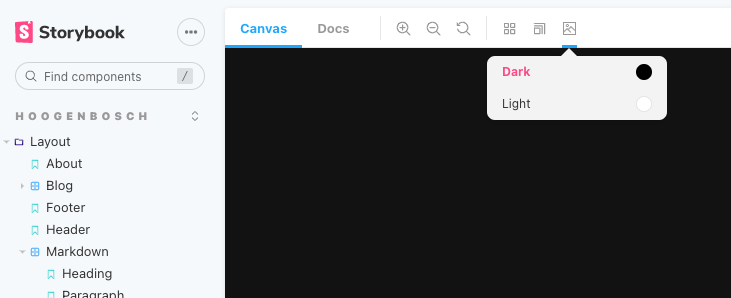

Since version 2.0 Tailwind CSS has a dark mode feature. When Implementing this in a project that uses Storybook for
component development you want to be able to quickly switch between light and dark mode.

To get started you first have to enable dark mode in Tailwind CSS and set the darkMode option to `class`.

```js
// tailwind.config.js
module.exports = {
    darkMode: 'class',
    ...
}
```

Next we need to install the themes addon for Storybook.

```shell
yarn add -D storybook-addon-themes
```

After the addon is installed we need to add it to storybook's configuration.

```js
// .storybook/main.js
module.exports = {
    addons: [
        'storybook-addon-themes',
        ...
    ],
    ...
}
```

The last step is to define the themes for the Storybook preview.

```js
// .storybook/preview.js
export const parameters = {
    themes: {
        clearable: false,
        list: [
            {
                name: 'Light',
                class: [],
                color: '#ffffff',
                default: true
            },
            {
                name: 'Dark',
                // The class dark will be added to the body tag
                class: ['dark'],
                color: '#000000'
            }
        ]
    }
}
```

The dark theme will add the class `dark` to the body when active. This enables the Tailwind CSS dark mode.

And that's it! ✨ You can now switch between dark and light theme in
Storybook.

[Click here for a working demo](/storybook/).