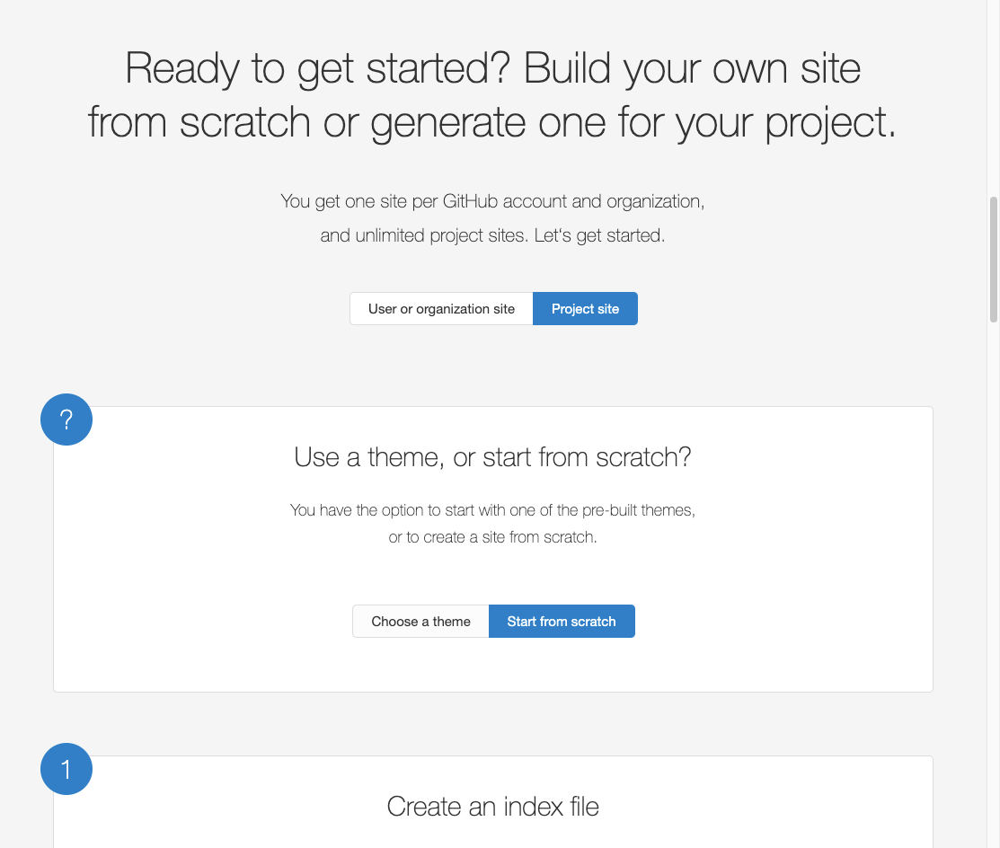

You've made a site using [Gatsby](https://gatsbyjs.com/)? Great! But how can you host it easily without a lot of effort
and without paying a penny?

Hosting a static website can be expensive and time-consuming to set up and maintain. This also means you have to pay at
least $5 each month for something simple and possibly low traffic as a portfolio, blog or open source demo website.

Luckily there is an easy way to host a static website for free: [**Github Pages**](https://pages.github.com/). Github
Pages makes it possible to host static content like html documents from a simple GitHub repository. Not only do they
offer this hosting for *free*, you also get a free subdomain `<username>.github.io` that includes a secure `https`
connection.

## Setting up github pages

You can follow the steps to set up github pages for a [user account](https://pages.github.com/#user-site) or for
a [open source project](https://pages.github.com/#project-site).

## Publishing gatsby

In order for the build output to be published to github pages it has to be placed in to a different branch than master.
This is because the source files will be inside the master branch.

## Using a builder/bundler

For a lot of static sites the HTML documents and assets are not manually put together but rather built or generated. An
example is the website you are currently on is made using [Gatsby](https://gatsbyjs.com)
and [React](https://reactjs.org).

## Use a custom domain

GitHub makes it possible to use a custom domain instead of `<username>.github.io`. First you need to register the domain
name and make sure you have access to change DNS settings.

Create a file named `CNAME` in the static folder of your gatsby project. The content of this file should be the domain
name of your

I created this personal website recently. I wrote a blog post about it which you can
find [here](/blog/how-i-built-my-website). The website is statically generated with a bunch of HTML, CSS and JS files.

